# Capítulo V: Product Implementation, Validation & Deployment

## 5.1 Software Configuration Management

### 5.1.1 Software Development Environment Configuration

En esta sección se describen las herramientas de software seleccionadas para dar soporte a las distintas fases del ciclo de vida del producto digital. Se incluyen sus nombres, objetivos específicos dentro del proyecto y los enlaces de acceso o descarga, diferenciando entre soluciones SaaS y aplicaciones instalables.
* **Gestión de Proyectos y Tareas**

| Herramienta | Uso principal | Enlace / Ruta de Acceso |
|---|---|---|
| **Jira Software** | Organización de tareas y entregables mediante tableros ágiles, tanto a nivel individual como por módulo. | [https://jira.atlassian.com](https://jira.atlassian.com) |
| **GitHub Projects** | Seguimiento de proyectos con enfoque en historias de usuario, issues y Pull Requests en repositorios. | [https://github.com/features/issues](https://github.com/features/issues) |

* **Diseño de Experiencia y UI/UX**

| Herramienta | Uso principal | Enlace / Ruta de Acceso |
|---|---|---|
| **Figma** | Diseño colaborativo de wireframes, mockups y prototipos navegables para la aplicación y Landing Page. | [https://figma.com](https://figma.com) |
| **Miro** | Elaboración de user flows, wireflows, Big Picture Event Storming y mapas de arquitectura. | [https://miro.com](https://miro.com) |
| **UXPressia** | Creación de User Personas, Empathy Maps, Journey Maps e Impact Maps. | [https://uxpressia.com](https://uxpressia.com) |

* **Desarrollo de Software**

| Herramienta / Tecnología | Uso principal | Enlace / Ruta de Descarga |
|---|---|---|
| **Visual Studio Code** | Entorno de desarrollo ligero para la edición del Landing Page con HTML5, CSS3 y JavaScript. | [https://code.visualstudio.com](https://code.visualstudio.com) |
| **WebStorm** | IDE principal para el desarrollo del Frontend SPA utilizando Vue 3 y TypeScript. | [https://www.jetbrains.com/webstorm/](https://www.jetbrains.com/webstorm/) |
| **Rider / Visual Studio** | Entorno de desarrollo integrado para la construcción del Backend API con ASP.NET Core y C#. | [https://www.jetbrains.com/rider/](https://www.jetbrains.com/rider/) |
| **HTML5** | Lenguaje de marcado para estructurar el contenido de la Landing Page. | [https://developer.mozilla.org/es/docs/Web/HTML](https://developer.mozilla.org/es/docs/Web/HTML) |
| **CSS3** | Lenguaje de estilos para definir la apariencia visual y responsiva de la Landing Page. | [https://developer.mozilla.org/es/docs/Web/CSS](https://developer.mozilla.org/es/docs/Web/CSS) |
| **Vue 3** | Framework progresivo de JavaScript para construir interfaces de usuario reactivas en la Web Application. | [https://vuejs.org](https://vuejs.org) |

* **Diseño de Arquitectura de Software**

| Herramienta | Uso principal | Enlace / Ruta de Acceso |
|---|---|---|
| **Mermaid** | Modelado de arquitectura mediante Diagramas como Código (Contexto, Contenedores C3, Clases y Base de datos). | [https://mermaid.js.org](https://mermaid.js.org) |

* **Despliegue de Software**

| Herramienta / Plataforma | Uso principal | Enlace / Ruta de Acceso |
|---|---|---|
| **Netlify** | Despliegue automático y gratuito de la Landing Page estática y el Frontend SPA. | [https://www.netlify.com](https://www.netlify.com) |
| **Render / Azure** | Despliegue en la nube del Backend API (ASP.NET Core) y alojamiento de la base de datos PostgreSQL. | [https://render.com](https://render.com) |

* **Documentación de Software**

| Herramienta / Recurso | Uso principal | Enlace / Ruta de Acceso |
|---|---|---|
| **Markdown** | Edición y mantenimiento de los archivos `.md` asociados a la documentación del proyecto. | [https://www.markdownguide.org](https://www.markdownguide.org) |
| **GitHub** | Repositorio con control de versiones, utilizado además como espacio de documentación en issues y PRs. | [https://github.com](https://github.com) |
| **Git** | Sistema distribuido de control de versiones para la gestión del código fuente. | [https://git-scm.com](https://git-scm.com) |
| **GitFlow Workflow** | Modelo de ramificación para mantener el código y la documentación organizados. | [https://nvie.com/posts/a-successful-git-branching-model](https://nvie.com/posts/a-successful-git-branching-model) |
| **Conventional Commits** | Convención de mensajes de commit para mejorar la trazabilidad y facilitar la generación de changelogs. | [https://www.conventionalcommits.org](https://www.conventionalcommits.org) |
### 5.1.2 Source Code Management
El equipo empleará GitHub como repositorio de alojamiento y Git como sistema de control de versiones para todos los entregables del proyecto FleetProof. Se aplicará la estrategia de ramificación GitFlow Workflow, con el uso de Semantic Versioning y mensajes estructurados bajo la convención de Conventional Commits.

**Repositorios del Proyecto**

| Producto | Repositorio GitHub |
|---|---|
| **Organización BLIP** | [https://github.com/1ASI0729-8088-BLIP](https://github.com/1ASI0729-8088-BLIP) |
| **Landing Page** | [https://github.com/1ASI0729-8088-BLIP/blip-fleetproof-LandingPage](https://github.com/1ASI0729-8088-BLIP/blip-fleetproof-LandingPage) |
| **Project Report** | [https://github.com/1ASI0729-8088-BLIP/blip-fleetproof-project-report](https://github.com/1ASI0729-8088-BLIP/blip-fleetproof-project-report) |
| **Frontend Web App** | [https://github.com/1ASI0729-8088-BLIP/blip-fleetproof-frontend](https://github.com/1ASI0729-8088-BLIP/blip-fleetproof-frontend) |
| **Backend API** | [https://github.com/1ASI0729-8088-BLIP/blip-fleetproof-backend](https://github.com/1ASI0729-8088-BLIP/blip-fleetproof-backend) |

**Modelo GitFlow**

Se seguirá el enfoque planteado por Vincent Driessen, el cual define dos ramas principales:
* `main`: contiene las versiones estables listas para producción.
* `develop`: integra nuevas funcionalidades antes de pasar al entorno de producción.

| Tipo de rama | Uso principal | Convención de nombres | Ejemplo |
|---|---|---|---|
| **feature** | Desarrollo de funcionalidades nuevas. | `feature/<nombre-descriptivo>` | `feature/sprint1-landing` |
| **release** | Preparación de una versión previa al despliegue. | `release/vX.Y.Z` | `release/v1.0.0` |
| **hotfix** | Corrección rápida de errores en producción. | `hotfix/<problema>` | `hotfix/fix-mobile-menu` |

**Versionado Semántico**

Se implementará el esquema Semantic Versioning 2.0.0, con el formato:

**MAJOR.MINOR.PATCH**
* **MAJOR:** cambios incompatibles con versiones anteriores.
* **MINOR:** incorporación de nuevas funciones compatibles.
* **PATCH:** corrección de errores o mejoras menores.

**Conventional Commits**

Los mensajes de commit seguirán el estándar Conventional Commits para asegurar trazabilidad y generar changelogs automáticos.

Formato general: `(opcional-scope): descripción breve`

Tipos de commit definidos:
* `feat`: nueva funcionalidad
* `fix`: corrección de errores
* `docs`: cambios en documentación
* `style`: ajustes de formato (espacios, comas, etc.) sin afectar lógica
* `refactor`: modificaciones de código sin impacto en funciones o errores
* `test`: adición o modificación de pruebas
* `chore`: tareas de mantenimiento o generales

### 5.1.3 Source Code Style Guide & Coding Conventions

Con el objetivo de mantener un código ordenado, consistente y fácil de mantener entre todos los miembros del equipo, se han definido las siguientes convenciones. Todas las variables, funciones, clases, archivos y elementos estarán en inglés.

* Se utilizará inglés como idioma único para nombres de variables, funciones, clases, comentarios y documentación técnica.
* Se evitarán abreviaciones innecesarias y nombres genéricos como `data1`, `temp`, `info`, etc.

**HTML**
Atributos en minúsculas y nombres de clase con `kebab-case` (`section-title`, `hero-grid`).
* Estructura semántica clara: uso de etiquetas como `<header>`, `<nav>`, `<main>`, `<section>`, `<footer>`.
* Sangría con 4 espacios.
* Atributos ordenados de manera lógica: `id`, `class`, `type`, `name`, `placeholder`, `value`, `required`, etc.

**CSS**
* Para clases personalizadas: usar `kebab-case`.
* Se agruparán variables globales en la seccion `:root` (paleta de colores y espaciado).

**Google TypeScript Style Guide**
Basado en el Google TypeScript Style Guide, se adoptan las siguientes reglas para mantener un código limpio y coherente en el desarrollo de la Web Application (Vue 3):

Nombres y sintaxis:
* `camelCase` para variables, funciones y parámetros.
* `PascalCase` para clases, interfaces, enums y tipos.
* Constantes con `UPPER_CASE_WITH_UNDERSCORES` si son globales.

Módulos y imports:
* Preferir imports explícitos y ordenados: primero bibliotecas externas, luego internas.
* Evitar `default exports`, usar siempre `export const` o `export class`.

Tipado y declaraciones:
* Siempre tipar explícitamente los parámetros y valores de retorno de funciones.
* Evitar `any` excepto cuando sea estrictamente necesario.
* Usar `readonly` para propiedades que no deben cambiarse.
* Interfaces en lugar de `type` cuando sea posible.

Buenas prácticas:
* Preferir `const` sobre `let`, y evitar `var`.
* Evitar usar `this` fuera de clases.
* No mezclar funciones y lógica en componentes — delegar a servicios.

**Vue 3 Style Guide**
Seguiremos las prácticas recomendadas por la documentación oficial de Vue 3:

Componentes:
* Nombres en `PascalCase` y con sufijo `Component` (ej. `VehicleReportComponent.vue`).
* Evitar lógica compleja en los templates: delegar a métodos o *composables* (Composition API).
* Uso de `<script setup>` para mayor legibilidad y rendimiento.

**C# y ASP.NET Core Conventions**
Para el desarrollo del Backend RESTful API:
* Nombres de Clases, Métodos e Interfaces (con prefijo `I`) en `PascalCase`.
* Variables locales y parámetros en `camelCase`.
* Estructura de carpetas basada en el diseño de Bounded Contexts y Domain-Driven Design (DDD).

**Pruebas / Gherkin**
En caso de usar Gherkin (para especificaciones o pruebas de los escenarios descritos en las User Stories):
* Usaremos el formato estandarizado `Given`, `When` y `Then`.

### 5.1.4 Software Deployment Configuration

1. **Ingresar a Netlify** 
   Accedemos a la plataforma mediante nuestras credenciales de Github en "Log in with GitHub".
   

2. **Autorizar a Netlify**  
   Damos permisos a Netlify de acceder a nuestra cuenta de GitHub para luego ir a la sección "Sites" y presionar "Add new site". Entonces, le damos a "Import an existing project".
   

3. **Escoger tu deploy**  
   En la parte de "Let's deploy your project with..." seleccionamos GitHub.
   

4. **Escoger tu repositorio**  
   Dado que nuestro repositorio está bajo una organización, la seleccionamos.
   

5. **Configurar el despliegue**  
   Ahora procedemos a configurar el despliegue, colocando el Site Name y seleccionando el Team, también debemos escoger una rama que en este caso será la Main.
   

6. **Seguir configurando**  
   Seguimos configurando, pero esta vez seleccionando el "Publish directory" colocamos public, para finalmente darle a "Deploy demy-academy".
   

7. **Despliegue listo**  
   Ahora podemos observar que el deploy está listo y podremos ver el enlace de la web a la landing page recién desplegada.
   

Ahora con la Landing Page desplegada, cada vez que se realize un push en la rama correspondiente, se actualizara automáticamente, de esta manera evitamos repetir los pasos.  
[Link de la Landing Page](https://fleetproof-landingpage.netlify.app/)

## 5.2 Landing Page, Services & Applications Implementation

### 5.2.1 Sprint 1

#### 5.2.1.1 Sprint Planning 1

| Sprint # | Sprint 1 |
|---|---|
| **Sprint planning background** | |
| Date | 2026/09/16 |
| Time | 5:00 PM |
| Location | Llamada grupal en la plataforma Discord |
| Prepared By | Sebastian Reyes Limo |
| Attendees (to planning meeting) | Sebastian Reyes Limo, Gonzalo Quintanilla, Jefferson Morales, Rodrigo Gómez De La Torre y Eduardo Gorbeña |
| **Sprint Goal & User Stories** | |
| Sprint 1 Goal | Nuestro enfoque está en presentar una landing page que muestre todas las funcionalidades y características de FleetProof a los visitantes. Creemos que esto generará una sólida primera impresión sobre qué es FleetProof para nuestros segmentos objetivo. Esto se confirmará cuando los usuarios accedan a la landing page y naveguen por sus secciones. |
| Sprint 1 Commitment | 21 Story Points |
| Sum of Planned Story Points | 21 |

#### 5.2.1.2 Aspect Leaders and Collaborators

Ahora presentaremos nuestro LACX (Leadership-and-Collaboration Matrix) que nos ayudará a saber quién lidera y quién colabora en cada aspecto de este primer sprint.
Los aspectos que tomamos en cuenta para este primer sprint fueron los features de nuestra Landing Page.

| Team Member Last Name, First Name | GitHub Username | Hero L/C | Nosotros L/C | Beneficios L/C | Precios L/C | Contacto L/C | Footer L/C |
|---|---|:---:|:---:|:---:|:---:|:---:|:---:|
| **Reyes Limo Sebastian** | llegastian11 | C | C | C | C | L | C |
| **Quintanilla Gonzalo** | GoldQP | L | C | C | C | C | C |
| **Morales Jefferson** | Fenfito | C | L | C | C | C | C |
| **Gómez De La Torre Rodrigo** | rod670 | C | C | C | L | C | C |
| **Gorbeña Eduardo** | EduardooGV | C | C | L | C | C | L |

**Nota.** L = *Leader* (responsable principal del aspecto).
C = *Collaborator* (apoya el desarrollo del aspecto).

#### 5.2.1.3 Sprint Backlog 1

<table>
    <tr>
        <td>Sprint #</td>
        <td colspan="7">Sprint 1</td>
    </tr>
    <tr>
        <td colspan="2">User Story</td>
        <td colspan="2">Work-Item / Task</td>
        <td>Description</td>
        <td>Estimation (Hours)</td>
        <td>Assigned To</td>
        <td>Status (Pendiente / En progreso / En revisión / Completado)</td>
    </tr>
    <tr>
        <td>Id</td>
        <td>Title</td>
        <td>Id</td>
        <td>Title</td>
        <td></td>
        <td></td>
        <td></td>
        <td></td>
    </tr>
    <tr>
        <td>US01</td>
        <td>Presentación de propuesta para flotas</td>
        <td>T1</td>
        <td>Diseñar estructura de la página principal</td>
        <td>Crear wireframe simple con encabezado, Hero section y pie de página de FleetProof.</td>
        <td>4</td>
        <td>Equipo UX</td>
        <td>Completado</td>
    </tr>
    <tr>
        <td>US01</td>
        <td>Presentación de propuesta para flotas</td>
        <td>T2</td>
        <td>Implementar página principal (Hero)</td>
        <td>Desarrollar HTML/CSS base de la página principal aplicando diseño Responsive.</td>
        <td>6</td>
        <td>Dev Front</td>
        <td>Completado</td>
    </tr>
    <tr>
        <td>US01</td>
        <td>Presentación de propuesta para flotas</td>
        <td>T3</td>
        <td>Redactar sección de Servicios</td>
        <td>Elaborar contenido con los pilares clave de la plataforma (Checklist, Semáforo, Alertas).</td>
        <td>2</td>
        <td>PO/Equipo</td>
        <td>Completado</td>
    </tr>
    <tr>
        <td>US01</td>
        <td>Presentación de propuesta para flotas</td>
        <td>T4</td>
        <td>Implementar sección de Servicios</td>
        <td>Codificar la sección en la landing page usando CSS Grid y Flexbox.</td>
        <td>4</td>
        <td>Dev Front</td>
        <td>Completado</td>
    </tr>
    <tr>
        <td>US02</td>
        <td>Beneficios para usuarios particulares</td>
        <td>T5</td>
        <td>Diseñar sección de Nosotros</td>
        <td>Definir estructura visual del equipo fundador y beneficios del Startup Profile.</td>
        <td>3</td>
        <td>Equipo UX</td>
        <td>Completado</td>
    </tr>
    <tr>
        <td>US02</td>
        <td>Beneficios para usuarios particulares</td>
        <td>T6</td>
        <td>Implementar sección de Nosotros</td>
        <td>Programar en frontend con estructura responsiva e imágenes adaptables.</td>
        <td>5</td>
        <td>Dev Front</td>
        <td>Completado</td>
    </tr>
    <tr>
        <td>US01</td>
        <td>Presentación de propuesta para flotas</td>
        <td>T7</td>
        <td>Diseñar sección de Planes</td>
        <td>Diseñar estructura de planes de suscripción con beneficios y precios diferenciados.</td>
        <td>3</td>
        <td>Equipo UX</td>
        <td>Completado</td>
    </tr>
    <tr>
        <td>US01</td>
        <td>Presentación de propuesta para flotas</td>
        <td>T8</td>
        <td>Implementar sección de Planes</td>
        <td>Codificar sección de Pricing en HTML y CSS con diseño corporativo.</td>
        <td>5</td>
        <td>Dev Front</td>
        <td>Completado</td>
    </tr>
    <tr>
        <td>US01</td>
        <td>Presentación de propuesta para flotas</td>
        <td>T9</td>
        <td>Redactar información de Contacto</td>
        <td>Crear contenido con correo corporativo, sedes y canales de WhatsApp.</td>
        <td>2</td>
        <td>PO/Equipo</td>
        <td>Completado</td>
    </tr>
    <tr>
        <td>US01</td>
        <td>Presentación de propuesta para flotas</td>
        <td>T10</td>
        <td>Implementar sección de Contacto</td>
        <td>Agregar formulario funcional simulado con validaciones básicas en JavaScript.</td>
        <td>4</td>
        <td>Dev Front</td>
        <td>Completado</td>
    </tr>
    <tr>
        <td>-</td>
        <td>-</td>
        <td>T11</td>
        <td>Configuración de hosting/despliegue</td>
        <td>Preparar entorno y publicar el Landing Page de FleetProof en Netlify.</td>
        <td>6</td>
        <td>DevOps</td>
        <td>Completado</td>
    </tr>
</table>

#### 5.2.1.4 Development Evidence for Sprint Review

Durante el Sprint 1 se implementó la Landing Page de la solución y se construyó la documentación base de arquitectura de software y experiencia de usuario. El desarrollo se realizó en los repositorios públicos de la organización BLIP, utilizando un flujo de ramas basado en feature branches y siguiendo la convención de *Conventional Commits*.

<h3>Development Evidence – Sprint 1</h3>

<table>
    <thead>
        <tr>
            <th>Repository</th>
            <th>Branch</th>
            <th>Commit Id</th>
            <th>Commit Message</th>
            <th>Commit Message Body</th>
            <th>Committed on (Date)</th>
        </tr>
    </thead>
    <tbody> 
        <tr>
            <td>1ASI0729-8088-BLIP/blip-fleetproof-project-report</td>
            <td>feature/sprint1-capitulo-1</td>
            <td>25f15d2</td>
            <td>docs: add impact maps to requirements specification</td>
            <td>Se agregan los Impact Maps al capítulo 3.</td>
            <td>17/09/2026</td>
        </tr>
        <tr>
            <td>1ASI0729-8088-BLIP/blip-fleetproof-project-report</td>
            <td>feature/sprint1-capitulo-1</td>
            <td>51945a0</td>
            <td>docs: add image for the impact mapping</td>
            <td>Inserción de imagen de Impact Mapping.</td>
            <td>17/09/2026</td>
        </tr>
        <tr>
            <td>1ASI0729-8088-BLIP/blip-fleetproof-project-report</td>
            <td>feature/sprint1-capitulo-1</td>
            <td>9827e21</td>
            <td>docs: add image for the Impact mapping</td>
            <td>Inserción de segunda imagen de Impact Mapping.</td>
            <td>17/09/2026</td>
        </tr>
        <tr>
            <td>1ASI0729-8088-BLIP/blip-fleetproof-project-report</td>
            <td>feature/sprint1-capitulo-1</td>
            <td>f4e52f6</td>
            <td>docs: Create gitkeep</td>
            <td>Creación de archivo .gitkeep para carpetas vacías.</td>
            <td>17/09/2026</td>
        </tr>
        <tr>
            <td>1ASI0729-8088-BLIP/blip-fleetproof-project-report</td>
            <td>feature/sprint1-capitulo-1</td>
            <td>7ed9426</td>
            <td>docs: implementación del punto 4.4.1</td>
            <td>Desarrollo del subcapítulo de wireframes 4.4.1.</td>
            <td>16/09/2026</td>
        </tr>
        <tr>
            <td>1ASI0729-8088-BLIP/blip-fleetproof-project-report</td>
            <td>feature/sprint1-capitulo-1</td>
            <td>54a86ca</td>
            <td>docs: Update requirements specification with new EPICs and US</td>
            <td>Actualización del capítulo 3 con nuevas épicas.</td>
            <td>16/09/2026</td>
        </tr>
        <tr>
            <td>1ASI0729-8088-BLIP/blip-fleetproof-project-report</td>
            <td>feature/sprint1-capitulo-1</td>
            <td>7011b29</td>
            <td>docs: Update user stories and product backlog details</td>
            <td>Refinamiento de las historias de usuario.</td>
            <td>16/09/2026</td>
        </tr>
        <tr>
            <td>1ASI0729-8088-BLIP/blip-fleetproof-project-report</td>
            <td>feature/sprint1-capitulo-1</td>
            <td>1470dbf</td>
            <td>docs: add Sebastian profile to chapter 1</td>
            <td>Adición del perfil de Sebastian al capítulo 1.</td>
            <td>16/09/2026</td>
        </tr>
        <tr>
            <td>1ASI0729-8088-BLIP/blip-fleetproof-LandingPage</td>
            <td>main</td>
            <td>e1d4b4a</td>
            <td>feat: migración de React a HTML, CSS y JS puro</td>
            <td>Se establece estructura SEO-friendly con Media Queries.</td>
            <td>16/09/2026</td>
        </tr>
        <tr>
            <td>1ASI0729-8088-BLIP/blip-fleetproof-LandingPage</td>
            <td>main</td>
            <td>a8b9c23</td>
            <td>feat: add hero section and responsive layout</td>
            <td>Implementación de la sección principal con tarjeta flotante.</td>
            <td>16/09/2026</td>
        </tr>
        <tr>
            <td>1ASI0729-8088-BLIP/blip-fleetproof-LandingPage</td>
            <td>main</td>
            <td>f4d5e67</td>
            <td>feat: implement pricing and services section</td>
            <td>Integración de la sección de precios y pilares en HTML.</td>
            <td>16/09/2026</td>
        </tr>
        <tr>
            <td>1ASI0729-8088-BLIP/blip-fleetproof-LandingPage</td>
            <td>main</td>
            <td>9a8b7c6</td>
            <td>style: fix mobile menu and media queries</td>
            <td>Ajustes de formato y funcionalidad de menú móvil.</td>
            <td>16/09/2026</td>
        </tr>
        <tr>
            <td>1ASI0729-8088-BLIP/blip-fleetproof-project-report</td>
            <td>feature/sprint1-capitulo-1</td>
            <td>a8979e7</td>
            <td>docs: Add new Epic/Stories and update product backlog</td>
            <td>Actualización de Épicas y Product Backlog.</td>
            <td>15/09/2026</td>
        </tr>
        <tr>
            <td>1ASI0729-8088-BLIP/blip-fleetproof-project-report</td>
            <td>feature/sprint1-capitulo-1</td>
            <td>a0aab1e</td>
            <td>docs: add image source for Jefferson Morales</td>
            <td>Imagen de perfil de Jefferson agregada.</td>
            <td>15/09/2026</td>
        </tr>
        <tr>
            <td>1ASI0729-8088-BLIP/blip-fleetproof-project-report</td>
            <td>feature/sprint1-capitulo-1</td>
            <td>6e0e68e</td>
            <td>docs(chapter-1): add image for the Student Profile</td>
            <td>Imagen agregada para el perfil de estudiante.</td>
            <td>15/09/2026</td>
        </tr>
        <tr>
            <td>1ASI0729-8088-BLIP/blip-fleetproof-project-report</td>
            <td>feature/sprint1-capitulo-1</td>
            <td>4b5c714</td>
            <td>docs: add .gitkeep to initialize assets directory</td>
            <td>Inicialización de directorio assets.</td>
            <td>15/09/2026</td>
        </tr>
        <tr>
            <td>1ASI0729-8088-BLIP/blip-fleetproof-project-report</td>
            <td>feature/sprint1-capitulo-1</td>
            <td>2ea12c5</td>
            <td>docs(assets): add .gitkeep to initialize assets directory</td>
            <td>Creación de carpeta de assets con gitkeep.</td>
            <td>15/09/2026</td>
        </tr>
        <tr>
            <td>1ASI0729-8088-BLIP/blip-fleetproof-project-report</td>
            <td>feature/sprint1-capitulo-1</td>
            <td>a51fd62</td>
            <td>docs: Add student profile for Jefferson Bayron Morales</td>
            <td>Perfil de Jefferson Morales añadido al documento.</td>
            <td>15/09/2026</td>
        </tr>
        <tr>
            <td>1ASI0729-8088-BLIP/blip-fleetproof-project-report</td>
            <td>feature/sprint1-capitulo-1</td>
            <td>6013c61</td>
            <td>docs: Implementación del capitulo 4.8</td>
            <td>Desarrollo del diagrama y diseño de Base de Datos.</td>
            <td>14/09/2026</td>
        </tr>
        <tr>
            <td>1ASI0729-8088-BLIP/blip-fleetproof-project-report</td>
            <td>feature/sprint1-capitulo-1</td>
            <td>ea11113</td>
            <td>docs: Implementación del capitulo 4.7</td>
            <td>Desarrollo de diagramas de clases Orientado a Objetos.</td>
            <td>14/09/2026</td>
        </tr>
        <tr>
            <td>1ASI0729-8088-BLIP/blip-fleetproof-project-report</td>
            <td>feature/sprint1-capitulo-1</td>
            <td>cca1296</td>
            <td>docs: Implementación del capitulo 4.6</td>
            <td>Desarrollo de Bounded Contexts y diagramas de contenedores.</td>
            <td>14/09/2026</td>
        </tr>
        <tr>
            <td>1ASI0729-8088-BLIP/blip-fleetproof-project-report</td>
            <td>feature/sprint1-capitulo-1</td>
            <td>f063dc1</td>
            <td>docs: Implementación del capitulo 4.5</td>
            <td>Redacción sobre el prototipado web.</td>
            <td>14/09/2026</td>
        </tr>
        <tr>
            <td>1ASI0729-8088-BLIP/blip-fleetproof-project-report</td>
            <td>feature/sprint1-capitulo-1</td>
            <td>6736595</td>
            <td>docs: Implementación del resto del capitulo 4.4</td>
            <td>Finalización de diagramas de flujos y UX.</td>
            <td>14/09/2026</td>
        </tr>
        <tr>
            <td>1ASI0729-8088-BLIP/blip-fleetproof-project-report</td>
            <td>feature/sprint1-capitulo-1</td>
            <td>d9e1715</td>
            <td>docs: inserción del capitulo 4.4.2</td>
            <td>Inserción de diagramas de flujo web.</td>
            <td>14/09/2026</td>
        </tr>
        <tr>
            <td>1ASI0729-8088-BLIP/blip-fleetproof-project-report</td>
            <td>feature/sprint1-capitulo-1</td>
            <td>fe6012a</td>
            <td>docs: fix image formatting in chapter IV for improved presentation</td>
            <td>Corrección de formato de imágenes en el cap 4.</td>
            <td>14/09/2026</td>
        </tr>
        <tr>
            <td>1ASI0729-8088-BLIP/blip-fleetproof-project-report</td>
            <td>feature/sprint1-capitulo-1</td>
            <td>379c8b3</td>
            <td>docs: update image source in chapter IV for improved accessibility</td>
            <td>Actualización de rutas de imágenes en artefactos de diseño.</td>
            <td>14/09/2026</td>
        </tr>
        <tr>
            <td>1ASI0729-8088-BLIP/blip-fleetproof-project-report</td>
            <td>feature/sprint1-capitulo-1</td>
            <td>87877ff</td>
            <td>docs: update chapter IV with mock-ups for FleetProof's web application on desktop and mobile</td>
            <td>Adición de mockups al capítulo 4.</td>
            <td>14/09/2026</td>
        </tr>
        <tr>
            <td>1ASI0729-8088-BLIP/blip-fleetproof-project-report</td>
            <td>feature/sprint1-capitulo-1</td>
            <td>14b0dcc</td>
            <td>docs: add additional wireframes for FleetProof's mobile interface in chapter IV</td>
            <td>Adición de wireframes en resolución móvil.</td>
            <td>14/09/2026</td>
        </tr>
        <tr>
            <td>1ASI0729-8088-BLIP/blip-fleetproof-project-report</td>
            <td>feature/sprint1-capitulo-1</td>
            <td>3b3d492</td>
            <td>docs: add wireframes for FleetProof's web application and mobile interface in chapter IV</td>
            <td>Inserción de wireframes de la app web.</td>
            <td>14/09/2026</td>
        </tr>
        <tr>
            <td>1ASI0729-8088-BLIP/blip-fleetproof-project-report</td>
            <td>feature/sprint1-capitulo-1</td>
            <td>af3331c</td>
            <td>docs: update chapter IV with detailed search and navigation systems, including wireframes for desktop and mobile</td>
            <td>Detalle de sistemas de búsqueda y navegación UX.</td>
            <td>14/09/2026</td>
        </tr>
        <tr>
            <td>1ASI0729-8088-BLIP/blip-fleetproof-project-report</td>
            <td>feature/sprint1-capitulo-1</td>
            <td>c6a3b77</td>
            <td>docs: add interview evidence to chapter 2</td>
            <td>Inclusión de capturas y enlaces a entrevistas.</td>
            <td>14/09/2026</td>
        </tr>
        <tr>
            <td>1ASI0729-8088-BLIP/blip-fleetproof-project-report</td>
            <td>feature/sprint1-capitulo-1</td>
            <td>3fda627</td>
            <td>docs: enhance chapter IV with SEO tags and meta tags for landing page and web application</td>
            <td>Definición de meta etiquetas SEO.</td>
            <td>13/09/2026</td>
        </tr>
        <tr>
            <td>1ASI0729-8088-BLIP/blip-fleetproof-project-report</td>
            <td>feature/sprint1-capitulo-1</td>
            <td>ff675f2</td>
            <td>docs: expand chapter IV with detailed labeling systems for FleetProof's web application and landing page</td>
            <td>Documentación del Labeling System.</td>
            <td>13/09/2026</td>
        </tr>
        <tr>
            <td>1ASI0729-8088-BLIP/blip-fleetproof-project-report</td>
            <td>feature/sprint1-capitulo-1</td>
            <td>f6655b4</td>
            <td>docs: update chapter IV with web style guidelines, responsive design, and information architecture</td>
            <td>Guías de estilo y arquitectura de información.</td>
            <td>13/09/2026</td>
        </tr>
        <tr>
            <td>1ASI0729-8088-BLIP/blip-fleetproof-project-report</td>
            <td>feature/sprint1-capitulo-1</td>
            <td>188bb31</td>
            <td>docs: update chapter IV with images, style guidelines, and project configuration files</td>
            <td>Subida inicial de imágenes y estilos corporativos.</td>
            <td>13/09/2026</td>
        </tr>
        <tr>
            <td>1ASI0729-8088-BLIP/blip-fleetproof-project-report</td>
            <td>feature/sprint1-capitulo-1</td>
            <td>8aeb9f3</td>
            <td>docs: update Sebastian technical profile</td>
            <td>Actualización de descripción técnica en el equipo.</td>
            <td>13/09/2026</td>
        </tr>
        <tr>
            <td>1ASI0729-8088-BLIP/blip-fleetproof-project-report</td>
            <td>feature/sprint1-capitulo-1</td>
            <td>af5bcc2</td>
            <td>docs: complete chapter 2 research artifacts</td>
            <td>Finalización de artefactos de investigación UX (User Journey, Empathy Maps).</td>
            <td>13/09/2026</td>
        </tr>
        <tr>
            <td>1ASI0729-8088-BLIP/blip-fleetproof-project-report</td>
            <td>feature/sprint1-capitulo-1</td>
            <td>2968509</td>
            <td>Update collaboration data for Sebastian Reyes Limo</td>
            <td>Matriz LACX actualizada.</td>
            <td>13/09/2026</td>
        </tr>
        <tr>
            <td>1ASI0729-8088-BLIP/blip-fleetproof-project-report</td>
            <td>feature/sprint1-capitulo-1</td>
            <td>8594853</td>
            <td>docs: Update 02-chapter-1-introduction.md</td>
            <td>Modificaciones en la introducción del documento.</td>
            <td>13/09/2026</td>
        </tr>
        <tr>
            <td>1ASI0729-8088-BLIP/blip-fleetproof-project-report</td>
            <td>feature/sprint1-capitulo-1</td>
            <td>9fef174</td>
            <td>docs: enhance chapter 1 introduction with detailed profiles of target segments and their needs</td>
            <td>Definición detallada de segmentos objetivo.</td>
            <td>12/09/2026</td>
        </tr>
        <tr>
            <td>1ASI0729-8088-BLIP/blip-fleetproof-project-report</td>
            <td>feature/sprint1-capitulo-1</td>
            <td>6e5f82a</td>
            <td>docs: add link to Lean UX Canvas in chapter 1 introduction for easy access</td>
            <td>Enlace al tablero Miro de Lean UX agregado.</td>
            <td>12/09/2026</td>
        </tr>
        <tr>
            <td>1ASI0729-8088-BLIP/blip-fleetproof-project-report</td>
            <td>feature/sprint1-capitulo-1</td>
            <td>094e49a</td>
            <td>docs: add Lean UX Canvas explanation and image for FleetProof in chapter 1</td>
            <td>Inserción visual del lienzo Lean UX.</td>
            <td>12/09/2026</td>
        </tr>
        <tr>
            <td>1ASI0729-8088-BLIP/blip-fleetproof-project-report</td>
            <td>feature/sprint1-capitulo-1</td>
            <td>7725de6</td>
            <td>docs: add Lean UX hypothesis statements for feature assumptions in chapter 1</td>
            <td>Definición de hipótesis UX para FleetProof.</td>
            <td>12/09/2026</td>
        </tr>
        <tr>
            <td>1ASI0729-8088-BLIP/blip-fleetproof-project-report</td>
            <td>feature/sprint1-capitulo-1</td>
            <td>a0b75bf</td>
            <td>docs: enhance section 1.2.2 with detailed business and user assumptions for clarity</td>
            <td>Supuestos de negocio y usuario detallados en sección 1.2.2.</td>
            <td>12/09/2026</td>
        </tr>
        <tr>
            <td>1ASI0729-8088-BLIP/blip-fleetproof-project-report</td>
            <td>feature/sprint1-capitulo-1</td>
            <td>b484374</td>
            <td>docs: refine Lean UX problem statement in chapter 1 introduction for clarity and detail</td>
            <td>Problem statement y formulación del problema definidos.</td>
            <td>12/09/2026</td>
        </tr>
        <tr>
            <td>1ASI0729-8088-BLIP/blip-fleetproof-project-report</td>
            <td>feature/sprint1-capitulo-1</td>
            <td>a4a48cb</td>
            <td>docs: add expand section 1.2.2 on Lean UX process with context on fleet management challenges</td>
            <td>Contexto inicial del proceso Lean UX y retos B2B.</td>
            <td>12/09/2026</td>
        </tr>
        <tr>
            <td>1ASI0729-8088-BLIP/blip-fleetproof-project-report</td>
            <td>feature/sprint1-capitulo-1</td>
            <td>1a2d38b</td>
            <td>docs: add expand chapter 1 introduction with detailed problem analysis and context</td>
            <td>Análisis de la problemática base en el sector automotor.</td>
            <td>12/09/2026</td>
        </tr>
        <tr>
            <td>1ASI0729-8088-BLIP/blip-fleetproof-project-report</td>
            <td>feature/sprint1-capitulo-1</td>
            <td>ea45553</td>
            <td>docs: update chapter 1 introduction with team member profiles</td>
            <td>Adición de la tabla de integrantes y descripciones.</td>
            <td>12/09/2026</td>
        </tr>
    </tbody>
</table>

#### 5.2.1.5 Execution Evidence for Sprint Review 

Durante el **Sprint 1** se implementó la Landing Page de la plataforma FleetProof, cumpliendo con los objetivos definidos en el Sprint Backlog.
La Landing Page constituye el primer punto de interacción con los usuarios, mostrando de forma clara los valores de la plataforma, los servicios ofrecidos, el perfil de la startup y los planes de suscripción disponibles.

El desarrollo se centró en:

* Diseño responsive y navegación entre secciones.
* Secciones implementadas: *Hero, Nosotros, Beneficios, Precios, Contacto, Footer*.
* Formulario de contacto con validaciones frontend implementadas.

A continuación, se presentan capturas de las principales vistas desarrolladas:

 

*Figura 5.1. Vista principal (Hero) de la Landing Page en versión de escritorio.*

 

*Figura 5.2. Vista de las secciones de Servicios y Precios de la plataforma.*

 

*Figura 5.3. Vista adaptable para dispositivos móviles con el diseño responsivo aplicado.*

#### 5.2.1.6 Services Documentation Evidence for Sprint Review

Durante el Sprint 1, el alcance principal fue la implementación de la Landing Page, por lo que no se desarrollaron servicios de backend asociados a la lógica de negocio. Sin embargo, se dejó preparado el repositorio de Web Services con estructura inicial de documentación en OpenAPI/Swagger, lo que permitirá en futuros sprints integrar endpoints de autenticación, consulta de información vehicular, generación de reportes y gestión de flotas.

#### 5.2.1.7 Software Deployment Evidence for Sprint Review

Durante el Sprint 1, se logró el despliegue exitoso de la Landing Page de FleetProof en un entorno de producción utilizando la plataforma de hosting Netlify. El entorno se encuentra configurado con integración continua (Continuous Deployment), lo que permite que cualquier cambio aprobado y fusionado en la rama `main` del repositorio de GitHub se publique de manera automática.

* **Plataforma de despliegue:** Netlify
* **Rama de despliegue:** `main`
* **URL de Producción:** [https://fleetproof-landingpage.netlify.app/](https://fleetproof-landingpage.netlify.app/)

A continuación, se presenta la evidencia del despliegue exitoso en la plataforma:

---
 

**Figura 5.4.** Evidencia de despliegue exitoso en la plataforma Netlify.

#### 5.2.1.8 Team Collaboration Insights during Sprint

Durante el Sprint 1, el equipo trabajó siguiendo la estrategia **GitFlow**, creando ramas específicas por cada *feature* o entregable de documentación (ejemplo: `feature/sprint1-capitulo-1`, `feature/sprint1-capitulo-2`, `feature/sprint1-capitulo-3`, `feature/sprint1-capitulo-4`, `feature/sprint1-capitulo-5`).

Estas ramas fueron integradas progresivamente en `develop` mediante Pull Requests y, tras la validación y resolución de conflictos correspondiente, se preparó el código consolidado para su integración en la rama principal `main`.

A continuación se presentan los **analíticos de GitHub**, que muestran la participación del equipo en commits, ramas y merges durante el Sprint. Estas evidencias confirman la colaboración activa de todos los miembros:

### 5.2.2 Sprint 2

#### 5.2.2.1 Sprint Planning 2

A continuación se presenta el sprint planning de esta segunda entrega, donde se definen el trabajo a realizar, las metas y el enfoque del equipo para el desarrollo del frontend de FleetProof.

| Sprint # | Sprint 2 |
|---|---|
| Sprint planning background | En este sprint se aborda la implementación del Frontend Web Application de FleetProof con Angular, integrando los bounded contexts Identity and Access Management, Vehicle Information, Report Management, Vehicle Monitoring y Fleet Management. Los módulos consumen una API simulada local mediante JSON Server y `db.json`, y reutilizan componentes e infraestructura de `shared`. El objetivo es preparar la primera versión funcional de la aplicación para demostrar el acceso, la consulta de vehículos y reportes, la importación de flotas y el seguimiento de cambios documentarios. |
| Date | Por confirmar con el equipo |
| Time | Por confirmar con el equipo |
| Location | Por confirmar con el equipo |
| Prepared By | Sebastian Reyes Limo |
| Attendees (to planning meeting) | Asistencia por confirmar: Sebastian Reyes Limo, Gonzalo Quintanilla, Jefferson Morales, Rodrigo Gómez De La Torre y Eduardo Gorbeña. |
| Sprint 1 Review Summary | Durante el Sprint 1 se implementó la Landing Page de FleetProof para presentar la propuesta de valor, los servicios, los beneficios, los planes y los canales de contacto dirigidos a nuestros segmentos objetivo. El reporte registra su publicación en Netlify y la elaboración de los artefactos iniciales de requisitos y diseño. Estos entregables constituyen la base para desarrollar la Web Application en el Sprint 2. |
| Sprint 1 Retrospective Summary | Como aprendizaje para la siguiente etapa, se identifica la necesidad de mantener coherencia entre los requisitos, el diseño y la implementación, y de delimitar las responsabilidades sobre los archivos del proyecto. Para el Sprint 2 se establece una distribución por bounded context, con una base común y reutilización de `shared`, para reducir cambios simultáneos y facilitar la revisión de las contribuciones. Esta síntesis se fundamenta en los ajustes del proyecto; no atribuye acuerdos ni comentarios a una reunión de retrospectiva no documentada. |
| **Sprint Goal & User Stories** | |
| Sprint 2 Goal | Nuestro enfoque está en desarrollar la primera versión del Frontend Web Application de FleetProof. Buscamos que nuestros usuarios puedan registrar y consultar vehículos, revisar reportes con información trazable, identificar riesgos, importar vehículos mediante CSV y comparar estados históricos. Esto se confirmará al revisar los recorridos de la aplicación con datos locales de demostración y validar la integración de los bounded contexts. |
| Sprint 2 Velocity | Pendiente de determinar al cierre del sprint con las historias aceptadas. |
| Sum of story points | 24: US03 (5), US04 (3), US06 (8) y US07 (8), según el Product Backlog actualizado del capítulo III. |

#### 5.2.2.2 Aspect Leaders and Collaborators

Ahora presentaremos nuestro LACX (Leadership-and-Collaboration Matrix) que nos ayudará a saber quién lidera y quién colabora en cada aspecto de este segundo sprint.
Los aspectos que tomamos en cuenta para este sprint fueron los bounded contexts de nuestra Web Application y la base reutilizable de `shared`.

| Team Member Last Name, First Name | GitHub Username | Shared L/C | Fleet Management L/C | IAM L/C | Report Management L/C | Vehicle Monitoring L/C | Vehicle Information L/C |
|---|---|:---:|:---:|:---:|:---:|:---:|:---:|
| **Reyes Limo Sebastian** | llegastian11 | L | L | C | C | C | C |
| **Quintanilla Gonzalo** | GoldQP | C | C | L | C | C | C |
| **Morales Jefferson** | Fenfito | C | C | C | C | L | C |
| **Gómez De La Torre Rodrigo** | rod670 | C | C | C | L | C | C |
| **Gorbeña Eduardo** | EduardooGV | C | C | C | C | C | L |

**Nota.** L = *Leader* (responsable principal del aspecto).
C = *Collaborator* (apoya el desarrollo del aspecto). La matriz representa la distribución de responsabilidades acordada.

#### 5.2.2.3 Sprint Backlog 2

<table>
    <tr>
        <td>Sprint #</td>
        <td colspan="7">Sprint 2</td>
    </tr>
    <tr>
        <td colspan="2">User Story</td>
        <td colspan="2">Work-Item / Task</td>
        <td>Description</td>
        <td>Estimation (Hours)</td>
        <td>Assigned To</td>
        <td>Status (Pendiente / En progreso / En revisión / Completado)</td>
    </tr>
    <tr>
        <td>Id</td><td>Title</td><td>Id</td><td>Title</td>
        <td></td><td></td><td></td><td></td>
    </tr>
    <tr><td>-</td><td>-</td><td>T12</td><td>Configurar el Frontend Web Application</td><td>Preparar Angular, Angular Material, environments y API local con db.json.</td><td>Por confirmar</td><td>Sebastian Reyes Limo</td><td>En revisión</td></tr>
    <tr><td>-</td><td>-</td><td>T13</td><td>Implementar shared e internacionalización</td><td>Reutilizar contratos HTTP, formularios, layout y diccionarios español e inglés.</td><td>Por confirmar</td><td>Sebastian Reyes Limo</td><td>En revisión</td></tr>
    <tr><td>-</td><td>-</td><td>T14</td><td>Implementar acceso y perfil</td><td>Desarrollar inicio de sesión, registro y edición de perfil con datos de demostración.</td><td>Por confirmar</td><td>Gonzalo Quintanilla</td><td>En revisión</td></tr>
    <tr><td>US03</td><td>Consulta inicial por placa</td><td>T15</td><td>Implementar registro y consulta de vehículos</td><td>Desarrollar listado, formulario y detalle de vehículos para la consulta por placa.</td><td>Por confirmar</td><td>Eduardo Gorbeña</td><td>En revisión</td></tr>
    <tr><td>US03</td><td>Consulta inicial por placa</td><td>T16</td><td>Implementar consulta de reportes</td><td>Generar y presentar reportes con datos locales, fuentes, fechas y estados de disponibilidad.</td><td>Por confirmar</td><td>Rodrigo Gómez De La Torre</td><td>En revisión</td></tr>
    <tr><td>US04</td><td>Evaluación con Semáforo de Riesgo</td><td>T17</td><td>Implementar evaluación visual de riesgo</td><td>Mostrar nivel de riesgo con texto, icono y color, acompañado de las causas de la clasificación.</td><td>Por confirmar</td><td>Rodrigo Gómez De La Torre</td><td>En revisión</td></tr>
    <tr><td>-</td><td>-</td><td>T18</td><td>Implementar exportación PDF</td><td>Generar un archivo PDF del reporte consultado desde la aplicación.</td><td>Por confirmar</td><td>Rodrigo Gómez De La Torre</td><td>En revisión</td></tr>
    <tr><td>US06</td><td>Carga masiva mediante CSV</td><td>T19</td><td>Implementar importación de vehículos</td><td>Validar columnas y placas, detectar duplicados y comunicar el resultado de la importación.</td><td>Por confirmar</td><td>Sebastian Reyes Limo</td><td>En revisión</td></tr>
    <tr><td>US07</td><td>Comparación histórica de Snapshots</td><td>T20</td><td>Implementar comparación de reportes</td><td>Presentar diferencias entre dos estados históricos de un vehículo.</td><td>Por confirmar</td><td>Rodrigo Gómez De La Torre</td><td>En revisión</td></tr>
    <tr><td>US07</td><td>Comparación histórica de Snapshots</td><td>T21</td><td>Implementar monitoreo y alertas</td><td>Ejecutar ciclos manuales de demostración y registrar alertas relacionadas con cambios vehiculares.</td><td>Por confirmar</td><td>Jefferson Morales</td><td>En revisión</td></tr>
    <tr><td>-</td><td>-</td><td>T22</td><td>Implementar gestión de flotas y casos</td><td>Crear flotas y registrar responsables, estados y evidencia de resolución de observaciones.</td><td>Por confirmar</td><td>Sebastian Reyes Limo</td><td>En revisión</td></tr>
    <tr><td>-</td><td>-</td><td>T23</td><td>Aplicar identidad visual de FleetProof</td><td>Incorporar logo, paleta del capítulo IV, tipografía Inter y adaptación móvil.</td><td>Por confirmar</td><td>Sebastian Reyes Limo</td><td>En revisión</td></tr>
    <tr><td>-</td><td>-</td><td>T24</td><td>Integrar y validar el frontend</td><td>Revisar las ramas de los contextos y comprobar la aplicación integrada.</td><td>Por confirmar</td><td>Todo el equipo</td><td>Pendiente</td></tr>
    <tr><td>-</td><td>-</td><td>T25</td><td>Configurar hosting y despliegue</td><td>Publicar el frontend en Netlify y configurar la Fake API en Render; validar disponibilidad y conexión pública.</td><td>Por confirmar</td><td>Por confirmar</td><td>En revisión</td></tr>
</table>

Las tareas continúan la numeración del Sprint 1, desde T12. Las estimaciones en horas requieren confirmación del equipo. El estado `En revisión` identifica implementaciones disponibles o evidencia presentada que aún requieren aceptación; no declara completados todos los criterios de las historias. T25 pasa a revisión por la evidencia de publicación en Netlify. T24 sigue pendiente de documentar la integración de ramas y su validación completa.

#### 5.2.2.4 Development Evidence for Sprint Review

Durante el Sprint 2 se preparó la primera versión del Frontend Web Application de FleetProof. La implementación utiliza Angular, Angular Material y TypeScript, con persistencia local mediante JSON Server y `db.json`. Se reutilizó la estructura del proyecto docente Learning Center y se organizaron los módulos mediante bounded contexts y capas de dominio, aplicación, infraestructura y presentación.

El desarrollo se encuentra en el repositorio público de la organización BLIP, utilizando ramas por contexto y la convención de *Conventional Commits*.

<h3>Development Evidence – Sprint 2</h3>

<table>
    <thead><tr><th>Repository</th><th>Branch</th><th>Commit Id</th><th>Commit Message</th><th>Commit Message Body</th><th>Committed on (Date)</th></tr></thead>
    <tbody>
        <tr><td>1ASI0729-7800-BLIP/blip-fleetproof-frontend</td><td>feature/sprint2-fleet-management</td><td><a href="https://github.com/1ASI0729-7800-BLIP/blip-fleetproof-frontend/commit/c9d1829">c9d1829</a></td><td>feat(shared): add src/app/shared/application/language.store.ts</td><td>—</td><td>05/10/2026</td></tr>
        <tr><td>1ASI0729-7800-BLIP/blip-fleetproof-frontend</td><td>feature/sprint2-fleet-management</td><td><a href="https://github.com/1ASI0729-7800-BLIP/blip-fleetproof-frontend/commit/ad9e14f">ad9e14f</a></td><td>feat(fleet): add src/app/fleet-management/application/csv-import.service.ts</td><td>—</td><td>05/10/2026</td></tr>
        <tr><td>1ASI0729-7800-BLIP/blip-fleetproof-frontend</td><td>feature/sprint2-iam</td><td><a href="https://github.com/1ASI0729-7800-BLIP/blip-fleetproof-frontend/commit/b763165">b763165</a></td><td>feat(user): add UserAssembler for transforming User entities and API resources</td><td>—</td><td>06/10/2026</td></tr>
        <tr><td>1ASI0729-7800-BLIP/blip-fleetproof-frontend</td><td>feature/sprint2-report-management</td><td><a href="https://github.com/1ASI0729-7800-BLIP/blip-fleetproof-frontend/commit/a79e65f">a79e65f</a></td><td>feat(report): implement PDF export service for vehicle reports</td><td>—</td><td>06/10/2026</td></tr>
        <tr><td>1ASI0729-7800-BLIP/blip-fleetproof-frontend</td><td>feature/sprint2-vehicle-monitoring</td><td><a href="https://github.com/1ASI0729-7800-BLIP/blip-fleetproof-frontend/commit/784d8e1">784d8e1</a></td><td>feat: Add Monitoring and Alert classes for vehicle monitoring</td><td>—</td><td>06/10/2026</td></tr>
        <tr><td>1ASI0729-7800-BLIP/blip-fleetproof-frontend</td><td>feature/sprint2-vehicle-monitoring</td><td><a href="https://github.com/1ASI0729-7800-BLIP/blip-fleetproof-frontend/commit/78e79a4">78e79a4</a></td><td>feat: Add MonitoringView component for vehicle monitoring</td><td>—</td><td>06/10/2026</td></tr>
        <tr><td>1ASI0729-7800-BLIP/blip-fleetproof-frontend</td><td>main, historial original</td><td><a href="https://github.com/1ASI0729-7800-BLIP/blip-fleetproof-frontend/commit/b33f249">b33f249</a></td><td>feat(vehicle-information): add vehicle information module, domain, infrastructure and presentation components</td><td>—</td><td>06/10/2026</td></tr>
    </tbody>
</table>

El commit original de Vehicle Information fue realizado por Eduardo en `main`. Sus archivos se conservaron posteriormente en `feature/sprint2-vehicle-information`. El traslado administrativo no se presenta como un nuevo commit de Eduardo. Los commits de los demás contextos mantienen su autoría original.

#### 5.2.2.5 Execution Evidence for Sprint Review

En este sprint se prepararon las principales vistas de FleetProof para el acceso a la plataforma, la consulta de vehículos, la visualización de reportes y el seguimiento documentario de flotas.

La versión local permite demostrar:

* Inicio de sesión y registro con datos de demostración, así como edición del perfil.
* Dashboard con indicadores de vehículos, riesgos y alertas.
* Registro, listado y detalle de vehículos.
* Reportes con fuentes, fechas de consulta, estados de disponibilidad y exportación PDF.
* Comparación histórica de snapshots.
* Monitoreo mediante ciclos manuales y revisión de alertas.
* Importación de vehículos mediante CSV y gestión de casos de resolución.
* Cambio de idioma español/inglés y adaptación a dispositivos móviles.

Las vistas utilizan el logotipo de FleetProof, la paleta cromática azul marino y verde petróleo y la tipografía Inter definidas en el capítulo IV.

La ejecución local utiliza `npm run dev`: el frontend se sirve en `http://127.0.0.1:4200` y la API simulada en `http://127.0.0.1:3000/api/v1`. Esta demostración no representa una consulta real a fuentes oficiales ni un servicio de autenticación de producción.

A continuación se presentan las capturas reales de la versión local completa utilizada para la demostración. Se verificaron el inicio de sesión con la cuenta demo, la navegación, la apertura del diálogo CSV y el cambio de idioma. No se registraron errores de ejecución JavaScript durante este recorrido; se observó una advertencia de rendimiento por la resolución del logo.

Para esta captura, el puerto 3000 estaba ocupado por otra API. El JSON Server propio se ejecutó en `127.0.0.1:3001` y el navegador de prueba redirigió las solicitudes a ese puerto, sin modificar el código. Las imágenes locales no acreditan el despliegue ni la integración remota de las ramas.

##### Acceso y perfil

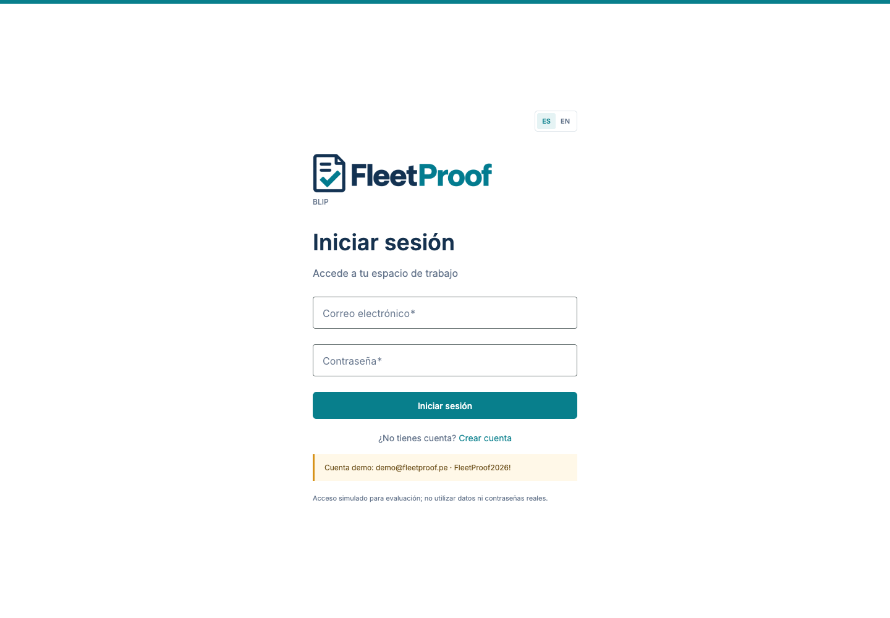

**Figura 5.5.** Formulario de inicio de sesión con identidad visual de FleetProof.

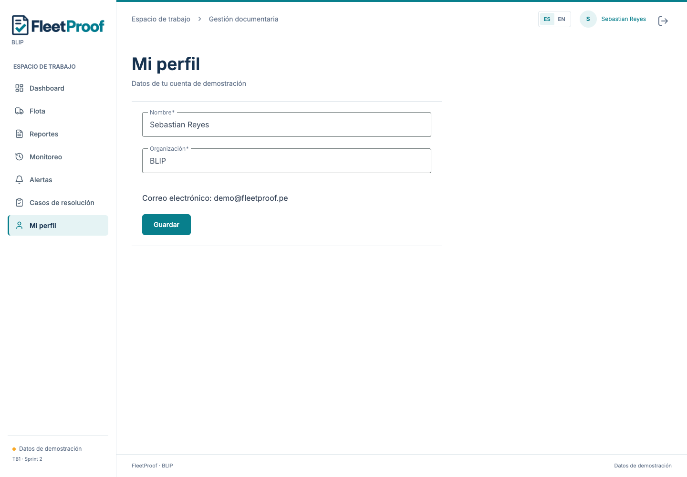

**Figura 5.6.** Vista de perfil. La captura acredita su visualización, no una actualización de datos.

##### Dashboard, internacionalización y adaptación móvil

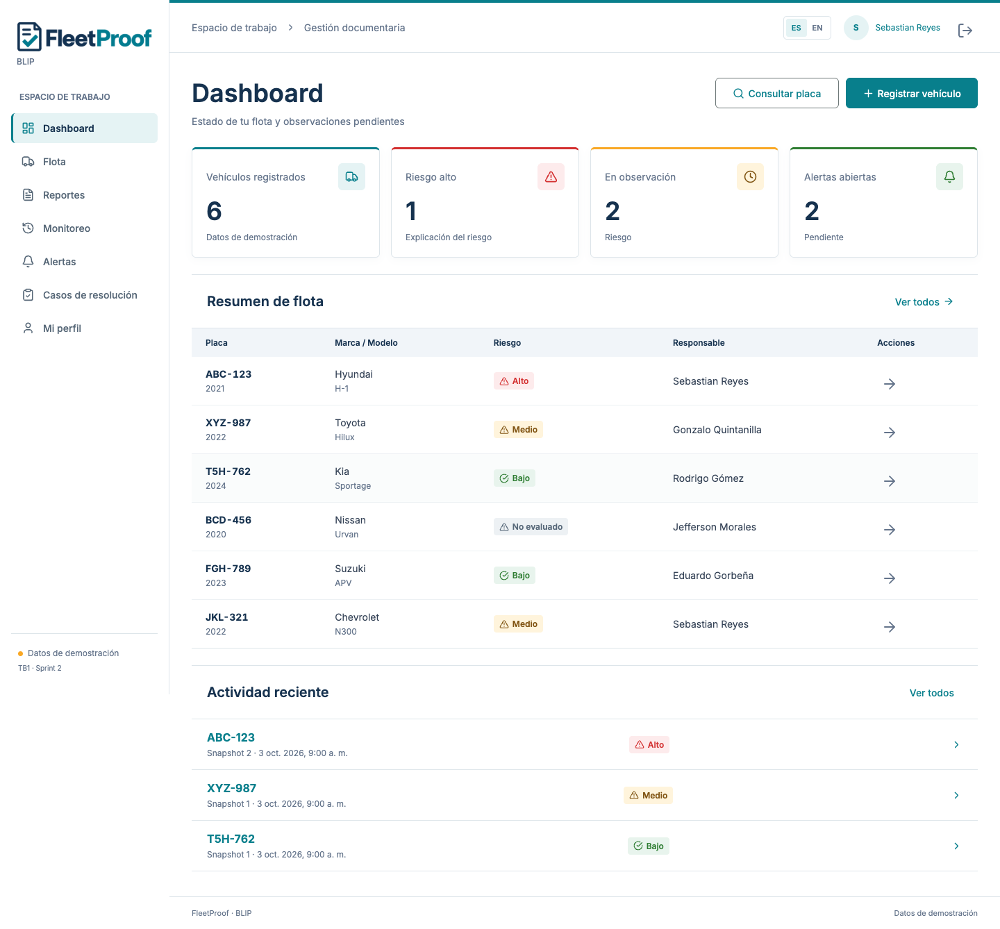

**Figura 5.7.** Indicadores y resumen de flota con datos de demostración.

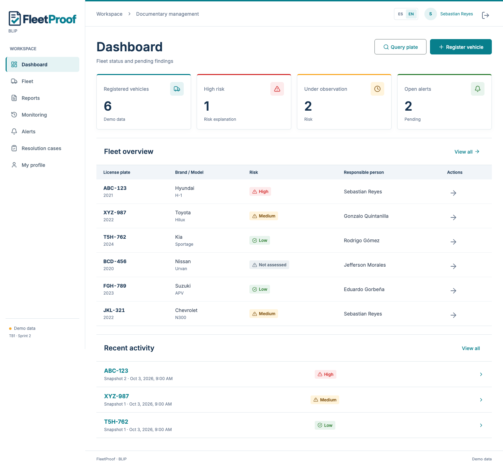

**Figura 5.8.** Resultado del cambio a inglés mediante el control EN.

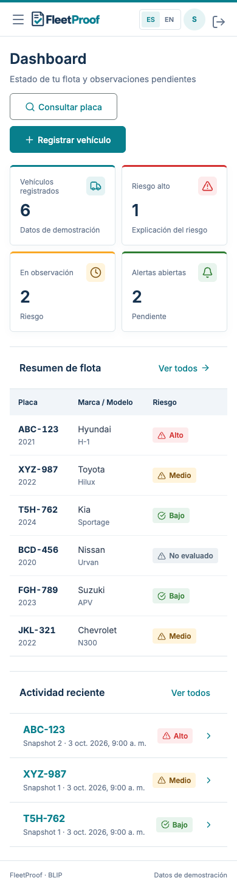

**Figura 5.9.** Adaptación del dashboard a un viewport de 390 × 844 píxeles; captura de página completa.

##### Vehículos y reportes

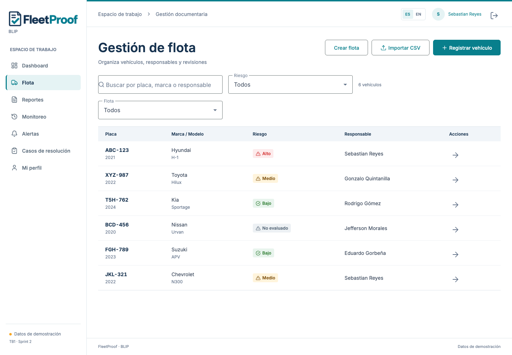

**Figura 5.10.** Listado de vehículos y sus estados de riesgo.

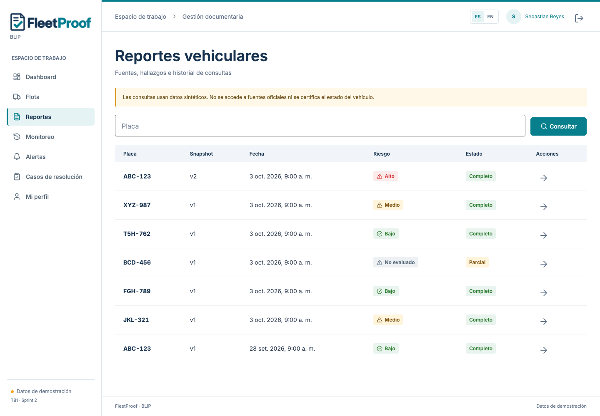

**Figura 5.11.** Reportes y versiones históricas disponibles.

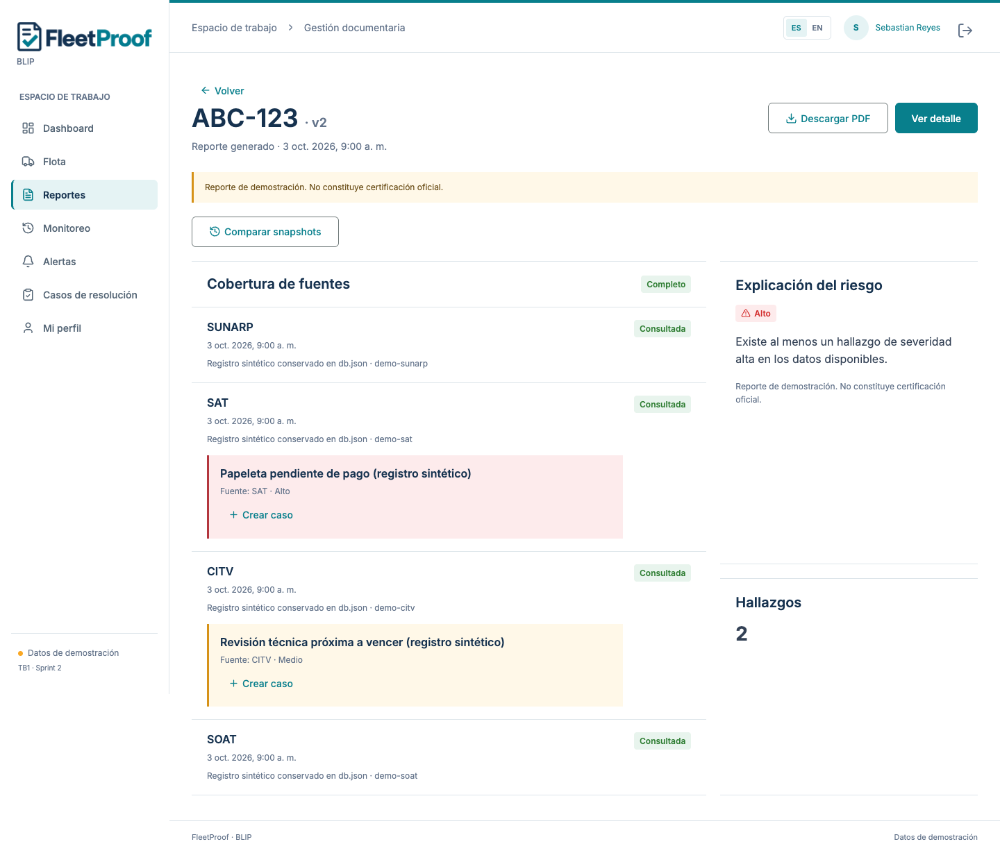

**Figura 5.12.** Detalle de un reporte existente con fuentes, fechas y riesgo. No se presenta como prueba de generación nueva o descarga PDF.

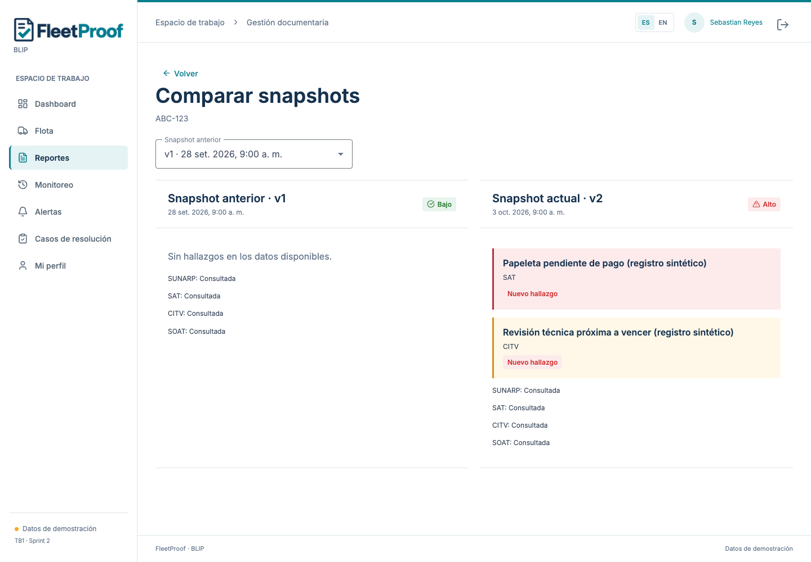

**Figura 5.13.** Vista de comparación histórica de snapshots.

##### Monitoreo, alertas y gestión de flotas

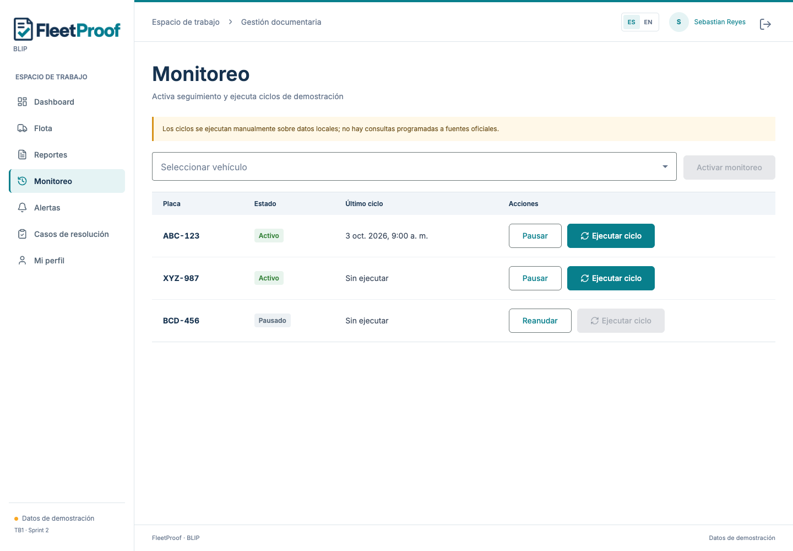

**Figura 5.14.** Vista de monitoreo. La captura no acredita la ejecución de un nuevo ciclo.

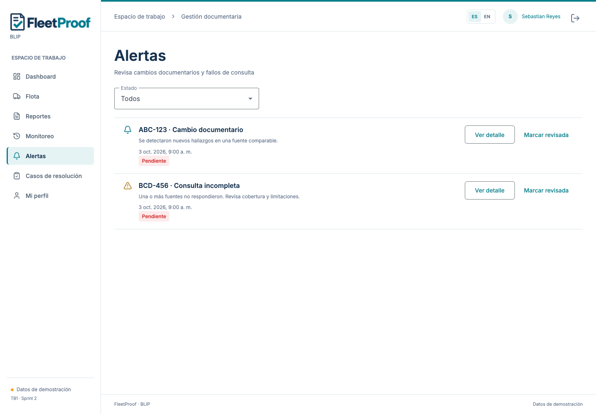

**Figura 5.15.** Visualización de alertas existentes.

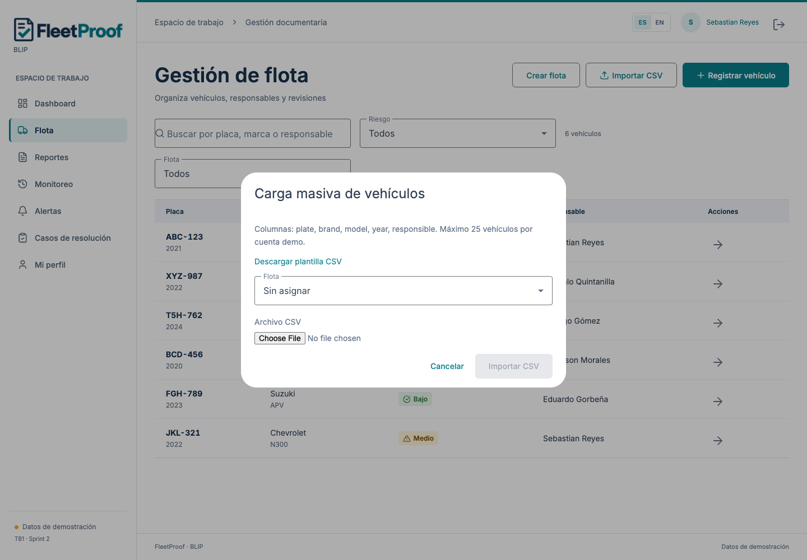

**Figura 5.16.** Diálogo de importación CSV abierto desde la interfaz. No se ejecutó una importación ni se acredita su resultado con esta imagen.

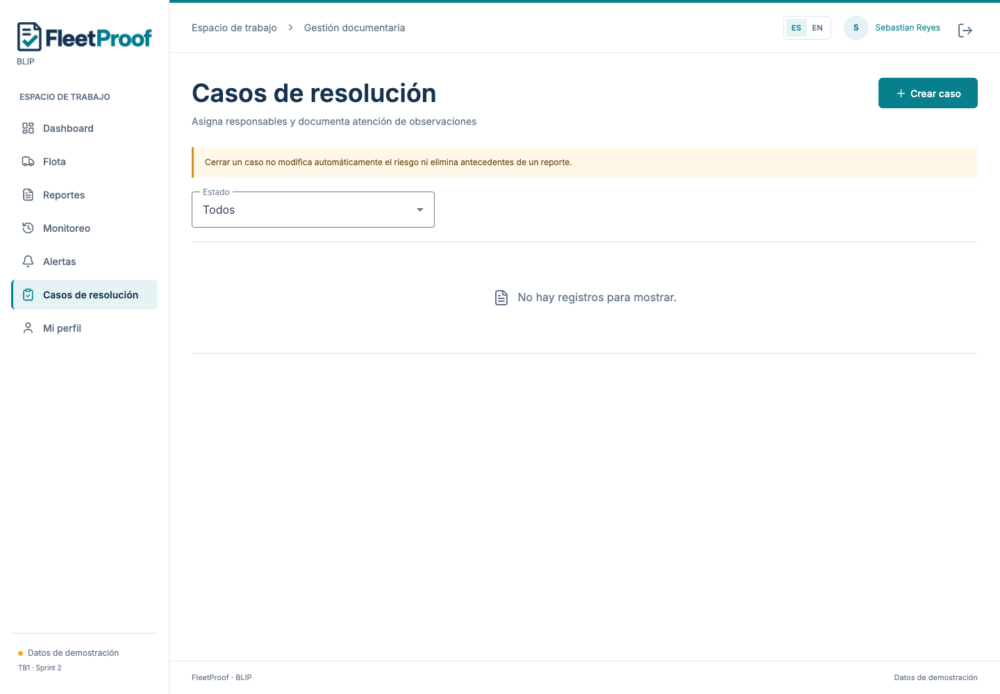

**Figura 5.17.** Vista de casos de resolución en el estado disponible de la demostración.

#### 5.2.2.6 Services Documentation Evidence for Sprint Review

Durante el Sprint 2, la Web Application consume datos de una API simulada local con JSON Server. Los recursos se almacenan en `db.json` y se accede a ellos mediante servicios HTTP organizados por bounded context. Este alcance permite demostrar el frontend antes de integrar el backend definitivo.

| Nombre del Endpoint | Acciones Implementadas | Sintaxis de Llamada | Especificación de Parámetros |
|---|---|---|---|
| Users | GET, POST, PATCH | `GET /api/v1/users`; `POST /api/v1/users`; `PATCH /api/v1/users/{id}` | Consulta de usuario para acceso simulado, registro y actualización de perfil. |
| Vehicles | GET, POST, PUT | `GET /api/v1/vehicles`; `POST /api/v1/vehicles`; `PUT /api/v1/vehicles/{id}` | Identificador, usuario, flota, placa, marca, modelo, año y responsable. |
| Reports | GET, POST | `GET /api/v1/reports`; `POST /api/v1/reports` | Vehículo, placa, fecha, versión y fuentes del reporte. |
| Source Fixtures | GET | `GET /api/v1/sourceFixtures` | Datos sintéticos utilizados para demostrar la consulta y disponibilidad de fuentes. |
| Fleets | GET, POST | `GET /api/v1/fleets`; `POST /api/v1/fleets` | Usuario y nombre de la flota. |
| Cases | GET, POST, PUT | `GET /api/v1/cases`; `POST /api/v1/cases`; `PUT /api/v1/cases/{id}` | Vehículo, reporte, observación, responsable, estado y evidencia de resolución. |
| Monitoring | GET, POST, PUT | `GET /api/v1/monitoring`; `POST /api/v1/monitoring`; `PUT /api/v1/monitoring/{id}` | Usuario, vehículo, estado y fecha del último ciclo. |
| Alerts | GET, POST, PUT | `GET /api/v1/alerts`; `POST /api/v1/alerts`; `PUT /api/v1/alerts/{id}` | Usuario, vehículo, reporte, tipo, estado, fecha y mensaje de la alerta. |

Para la internacionalización, ngx-translate carga los archivos `/i18n/es.json` y `/i18n/en.json` desde el frontend. Postman permite consultar los recursos HTTP y los diccionarios, pero no realiza la traducción de la interfaz.

La tabla anterior documenta los contratos HTTP de la versión local utilizada en la demostración. No se declara documentación Swagger del backend, porque esta entrega utiliza una API simulada. Tampoco se presenta una captura de Render como prueba de una solicitud ejecutada en Postman: las capturas de solicitudes y respuestas siguen pendientes.

La configuración de alojamiento de la Fake API se muestra en la sección 5.2.2.7. La disponibilidad pública de cada endpoint y su equivalencia con estos contratos requieren verificación adicional.

#### 5.2.2.7 Software Deployment Evidence for Sprint Review

Para el Sprint 2, el equipo utiliza Netlify para el despliegue del Frontend Web Application y Render para alojar la Fake API basada en JSON Server. La configuración permite separar la publicación de la interfaz y el servicio de datos de demostración.

* **Plataforma de despliegue del frontend:** Netlify.
* **Plataforma de despliegue de la Fake API:** Render.
* **Commit del frontend mostrado en Netlify:** `635fe67`. La captura muestra una rama abreviada como `feature/spri...`; su nombre completo queda pendiente de confirmar.
* **URL de la Web Application:** [blip-fleetproof.netlify.app](https://blip-fleetproof.netlify.app/).
* **URL configurada de la Fake API:** [fleetproof-fake-api.onrender.com](https://fleetproof-fake-api.onrender.com/).
* **Repositorio de la Fake API mostrado en Render:** `1ASI0729-7800-BLIP/blip-fleetproof-fake-api`, rama `main`, commit `13dffa7`.

Las siguientes evidencias fueron proporcionadas por el equipo. Se diferencia la configuración y construcción en progreso de la publicación completada. Las URLs se transcriben de las capturas; estas imágenes no constituyen una comprobación actual de disponibilidad ni prueban por sí solas la conexión del frontend con todos los endpoints.

##### Configuración de la Fake API en Render

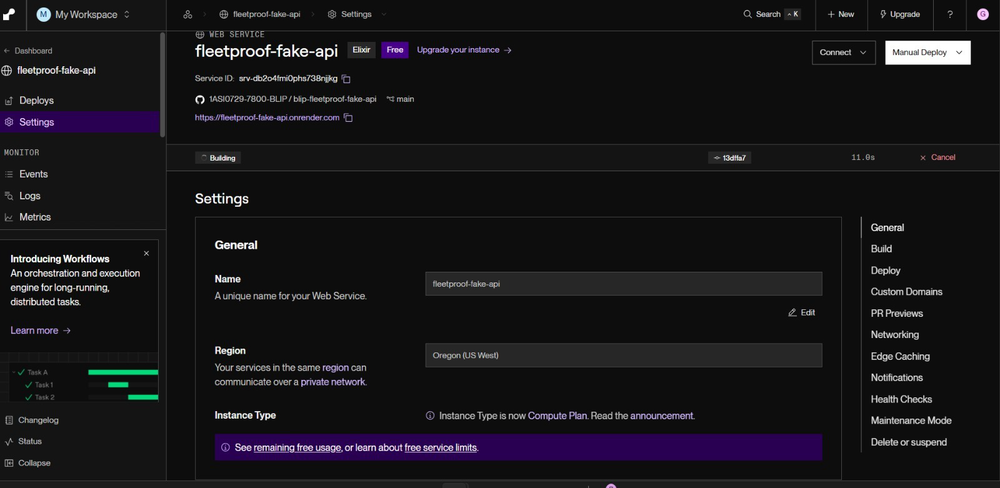

**Figura 5.18.** Servicio `fleetproof-fake-api` y URL configurada en Render. El estado visible es `Building`, por lo que esta imagen no acredita una publicación completada. La interfaz muestra el runtime `Elixir`; queda pendiente revisar su correspondencia con la Fake API basada en JSON Server descrita en el proyecto.

##### Construcción y publicación del frontend en Netlify

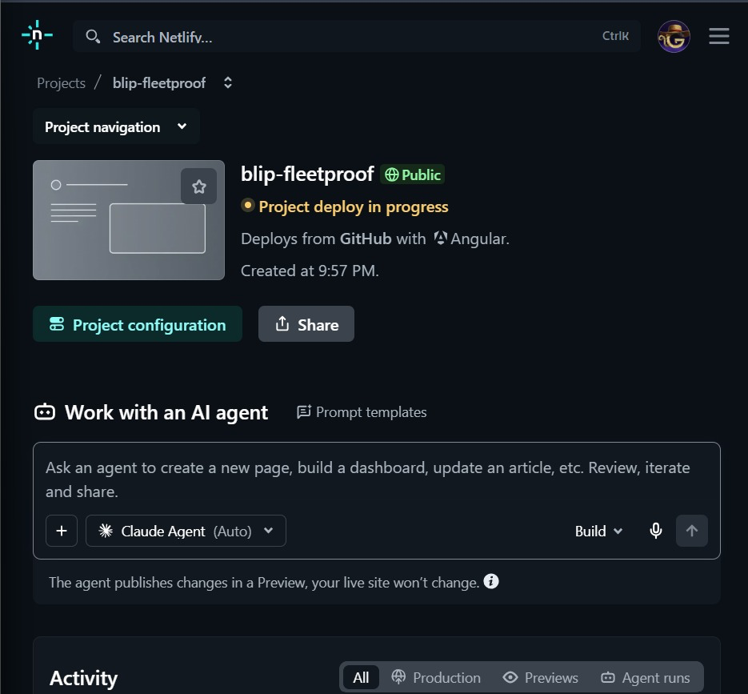

**Figura 5.19.** Proyecto `blip-fleetproof` en Netlify durante el despliegue, con detección de Angular.

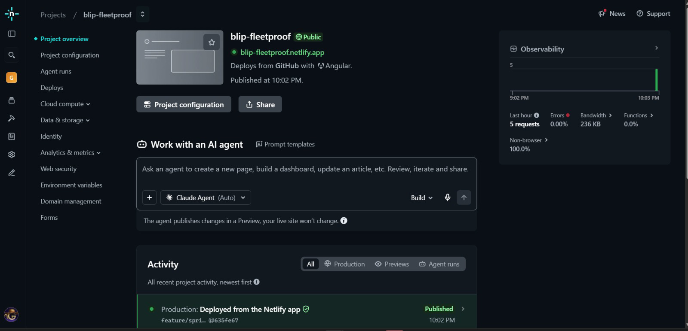

**Figura 5.20.** Publicación del frontend confirmada por el estado `Published`, la URL pública y el commit abreviado `635fe67` visibles en Netlify.

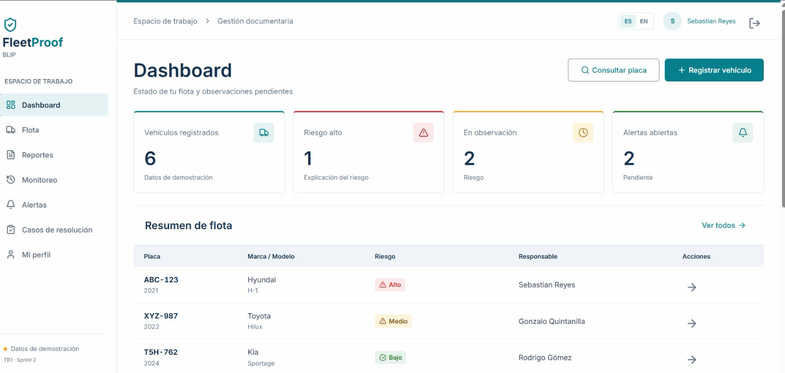

**Figura 5.21.** Dashboard identificado por el equipo como correspondiente a la versión desplegada. La captura muestra la interfaz y datos de demostración, pero no incluye la barra de direcciones; se complementa con la evidencia de publicación de Netlify.

Queda pendiente añadir evidencia de Render en estado publicado y una solicitud/respuesta pública que compruebe la conexión con la Fake API. La Landing Page del Sprint 1 corresponde a un entregable distinto.

#### 5.2.2.8 Team Collaboration Insights during Sprint

Durante el Sprint 2, el equipo organizó el desarrollo de la Web Application mediante ramas específicas para cada bounded context. Los archivos base se mantienen en `main`, mientras que `shared` y Fleet Management se encuentran en la rama de Sebastian.

| Integrante | Rama de trabajo | Aspecto |
|---|---|---|
| Sebastian Reyes Limo | `feature/sprint2-fleet-management` | Shared y Fleet Management |
| Gonzalo Quintanilla | `feature/sprint2-iam` | Identity and Access Management |
| Rodrigo Gómez De La Torre | `feature/sprint2-report-management` | Report Management |
| Jefferson Morales | `feature/sprint2-vehicle-monitoring` | Vehicle Monitoring |
| Eduardo Gorbeña | `feature/sprint2-vehicle-information` | Vehicle Information |

Los historiales de las ramas registran aportes de los integrantes. La revisión e integración mediante Pull Requests permitirá consolidar la versión del sprint conservando los commits y sus autores. No se presenta esa integración como realizada mientras siga pendiente.

A continuación se presentan los analíticos del repositorio frontend proporcionados por el equipo:

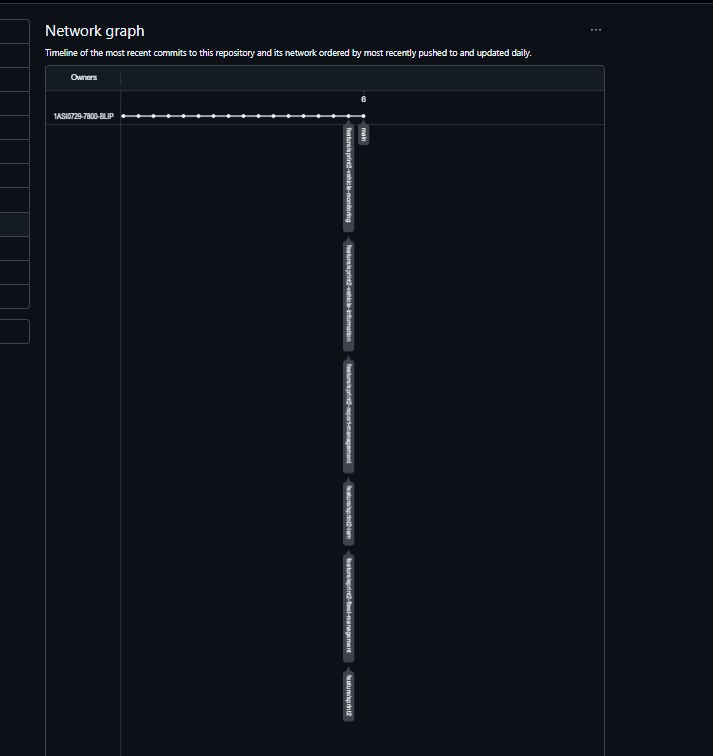

**Figura 5.22.** Network graph de GitHub con las referencias `main`, `feature/sprint2` y las ramas de los bounded contexts. El gráfico representa el historial visible en el momento de la captura; no constituye por sí solo evidencia de revisión mediante Pull Requests.

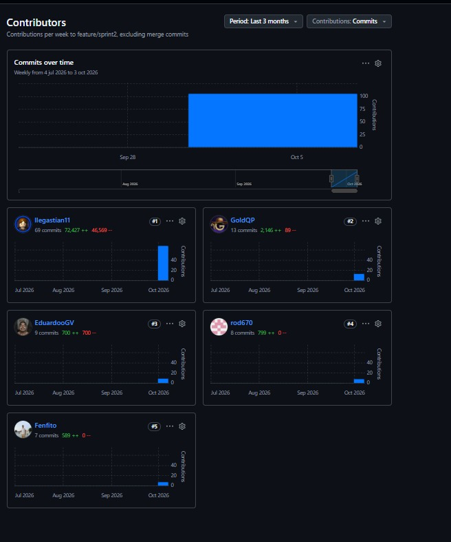

**Figura 5.23.** Contributors de GitHub para `feature/sprint2`, con el filtro de los últimos tres meses y exclusión de merge commits. Se visualizan los cinco integrantes del equipo.

| GitHub Username | Commits visibles en la captura |
|---|---:|
| llegastian11 | 69 |
| GoldQP | 13 |
| EduardooGV | 9 |
| rod670 | 8 |
| Fenfito | 7 |

Estos valores corresponden al alcance y periodo del gráfico, no necesariamente a commits exclusivos del Sprint 2. La cantidad de commits no mide por sí sola la calidad, el esfuerzo ni la aceptación de las tareas. Queda pendiente incorporar evidencia de los Pull Requests y revisiones del frontend; estos analíticos no prueban su integración en `develop`.

[Repositorio del Frontend Web Application](https://github.com/1ASI0729-7800-BLIP/blip-fleetproof-frontend)
